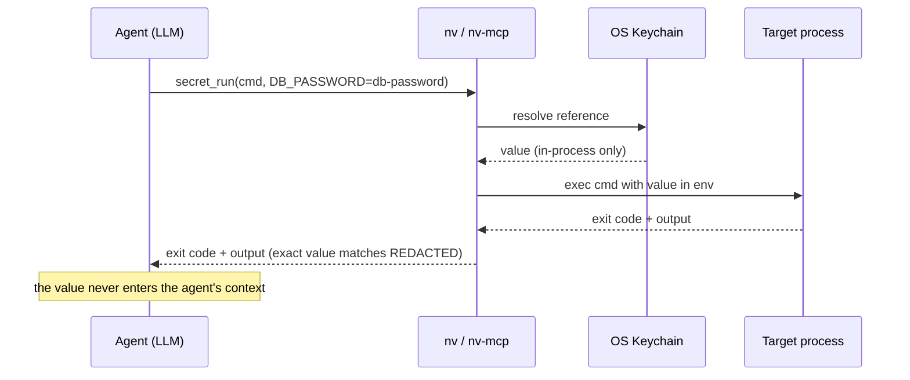

# llm-secret-manager

**The secret manager for LLM agents: they can create, rotate, and use your
secrets — without ever being able to read them.**

[](LICENSE)
[](mcp/nv-mcp.py)
[](bin/nv)
[](https://modelcontextprotocol.io)

LLM agents are great at ops work — deploying, rotating credentials, wiring up
services. But every secret that enters an agent's context lives on in
transcripts, logs, and telemetry you don't control. The usual fix is "be
careful". This is a better fix: **make it impossible.**

`llm-secret-manager` turns your OS keyvault into something an agent operates
**like an HSM**: it can order secrets into existence, rotate them, and run
programs with them — but there is *no operation that returns a secret*. Not to
the agent, not to a log, not "just for debugging". Three layers, use any or
all: the **`nv` CLI**, a zero-dependency **MCP server**, and a Claude Code
**guard hook** that blocks commands which would print a secret.

```text
you      $ claude "create a DB password and run the migration with it"

agent    → secret_generate("db-password")        ⇒ ok, length 32   (value never seen)
agent    → secret_run(["python","manage.py","migrate"],
                      env={"DB_PASSWORD": "db-password"})
                                                 ⇒ exit 0          (value went kernel → process env)

you      $ nv run DB_PASSWORD=db-password -- psql   # same reference, your shell
```

## Why you can trust it (hint: you don't have to)

There is nothing here *to* trust. No custom crypto, no storage format, no
server state, no dependencies. Storage, encryption, locking, and session
binding are the **OS keyvault's own** (macOS login Keychain). `native-vault`
is ~150 lines of shell and one stdlib-only Python file — auditable in one
sitting — that only ever call the OS's native `security` tooling.

## The three invariants

1. **Blind generation.** `nv generate api-token` creates the value in a local
   subprocess and writes it straight into the vault (via stdin — it never
   appears in `ps`, files, or history). The agent that ordered it gets back:
   `stored, length 32`. Nothing else.

2. **No `get` verb — by design.** Grep the code: there is no command and no
   MCP tool that returns secret material. The only escape hatch is the OS
   vault UI (Keychain Access), which is yours, not the agent's.

3. **Reads resolve only at injection time.** Everywhere else, secrets are
   *references* (`DB_PASSWORD=api-token`). `nv run` resolves them at the last
   possible moment, straight into the target process's environment — the
   HSM-call pattern:



## Quickstart (macOS)

```bash
git clone https://github.com/NG-Bullseye/llm-secret-manager && cd llm-secret-manager
sudo ln -s "$PWD/bin/nv" /usr/local/bin/nv

nv generate my-api-key            # blind: created and stored, never shown
nv run API_KEY=my-api-key -- ./deploy.sh
nv list my-                       # names only
nv rotate my-api-key              # fresh value, same reference
nv import legacy-password         # hidden interactive prompt for existing secrets
nv delete my-api-key
```

Native rules apply unchanged: the login keychain only opens inside an
**unlocked GUI session**. Over plain SSH, reads *and* writes fail — that's
Apple's access model doing its job (and why the MCP server below runs as a
LaunchAgent inside your session).

## Shared vaults: the Bitwarden backend

The login keychain is *yours*. Team and customer secrets usually live in a
shared vault instead, and `nv` cannot reach those. `bin/bwv` is the same
contract against Bitwarden:

```bash
export BWV_BOOTSTRAP=my-bitwarden           # keychain item holding the master password

bwv list 'Railway · '                       # item names only
bwv check TOKEN='Railway · Token:Token'     # → TOKEN: 36 chars   (never the value)
bwv run TOKEN='Railway · Token:Token' -- ./deploy.sh
```

There is no `get` verb here either. The vault is unlocked for exactly one
resolution pass and locked again; the session key is never persisted.

Three things it does differently from a hand-rolled `bw` wrapper, each because
the naive version bit someone:

- **Exact item names.** `bw get item` matches substrings, so `Railway · Token`
  can resolve to several items and fail — or worse, to the wrong one. A
  reference that does not match exactly one item is an error.
- **`bw sync` first.** An item created in the web or desktop app is invisible
  to the CLI until a sync. Skipping it produces "no such item" for an item you
  are looking at on screen.
- **Explicit fields.** `:<field>` selects a login field (`username`,
  `password`) or a custom field by exact name; without it, login password then
  custom field `wert`. When resolution fails, the error names the fields the
  item actually has — that one line is usually the whole debugging session.

The master password comes from the OS keychain via `bin/with-secrets`, so the
unlock chain still ends in the native vault: no second credential store, and
the same GUI-session rule applies. Machine callers export `BW_PASSWORD`
directly instead (that is how the MCP server and the LaunchAgent run).

## MCP server: give every agent a vault, not a secret

`mcp/nv-mcp.py` (Python ≥ 3.9, **zero dependencies**) exposes eight tools:
`secret_generate` · `secret_rotate` · `secret_list` · `secret_delete` ·
`secret_run` for the keychain, and `bw_list` · `bw_check` · `bw_run` for
Bitwarden. Values resolve inside the server process and go into the child's
environment; any **exact occurrence of a resolved value in captured output is
redacted** before results return to the client.

On the Bitwarden path the server never holds the value at all — `bwv` resolves
it in its own child — so `bw_run` passes `--redact`, which makes `bwv` filter
the output before it comes back. Same guarantee, enforced one process further
out.

```bash
scripts/install-launchagent.sh    # → http://127.0.0.1:8765/mcp (loopback only)
claude mcp add --transport http native-vault http://127.0.0.1:8765/mcp
```

Remote agents you trust (say, a headless build box) reach it through an SSH
tunnel — the server never leaves loopback:

```bash
ssh -N -L 8765:127.0.0.1:8765 your-mac &
```

Log out of the Mac and the vault seals, the server loses access, and every
agent is locked out at once. Nothing to revoke, nothing to remember —
native semantics are the kill switch.

## Enforcement: the guard hook

The vault layer makes leaks unnecessary; the guard makes them **hard even on
purpose**. `hooks/guard-secrets.sh` is a Claude Code PreToolUse hook that
denies Bash commands which would write a secret into the agent's context —
before they run, even in `bypassPermissions` mode:

```bash
./install.sh        # installs with-secrets + the guard hook (idempotent)
```

Blocked: cleartext keychain reads (`security ... -w`), keychain reads through
interpreters (`keyring.get_password`, …), full environment dumps
(`env`/`printenv`), `echo`/`printf` of secret-looking variables — including
the sneaky `${VAR:-fallback}`, which returns the *value* when set. Still
allowed: injection without printing (`nv run`, `with-secrets`) and existence
checks via `${#VAR}`. Test suite: `test/run-tests.sh`.

`bin/with-secrets` is the standalone injector for pre-existing secrets
(`with-secrets VAR=service -- cmd`, plus `--check` to verify presence by
length only) — same invariants, no vault management, works without the MCP
server.

## What this protects against — and what it doesn't

- **Protects:** secrets leaking into LLM contexts and transcripts, logs,
  shell history, process argv, files on disk, accidental echo (exact-match
  redaction).
- **Doesn't:** same-user privilege separation. Processes running as you, in
  your unlocked session, are equal in the eyes of the OS. This is leak
  prevention plus one auditable choke point — not a permission boundary. A
  hostile agent could still tell a child process to re-encode and exfiltrate
  a secret it legitimately received; the choke point makes exactly that
  visible and greppable.

The full, honest version: [docs/THREAT-MODEL.md](docs/THREAT-MODEL.md).

## FAQ

**Why not a password manager CLI (1Password `op`, Bitwarden `bw`, `pass`)?**
Those are built for *humans reading secrets* — they all have a `get`. Their
agent story is "pipe the secret into the model's shell and hope". native-vault
is the inverse: the read path simply doesn't exist in the agent's toolset.

**Why the OS keyvault instead of an encrypted file?**
Because you already trust it — it holds your Wi-Fi and browser passwords, it
locks with your session, it's maintained by your OS vendor. Adding parallel
crypto would add a parallel thing to audit and break.

**Linux / Windows?**
The verb layer is backend-agnostic; macOS Keychain is the reference
implementation. `secret-tool` (libsecret) and Windows Credential Manager
backends are welcome — under the hard rule that they preserve the three
invariants (see THREAT-MODEL.md, "Design consequences").

**What about the moment of generation?**
The generating subprocess holds the value in RAM for milliseconds — as does
any system, HSM callers included. It's never printed, never persisted, and
the process that *ordered* the generation (the agent) is a different process
than the one that briefly held it. That separation is the point.

## License

MIT
